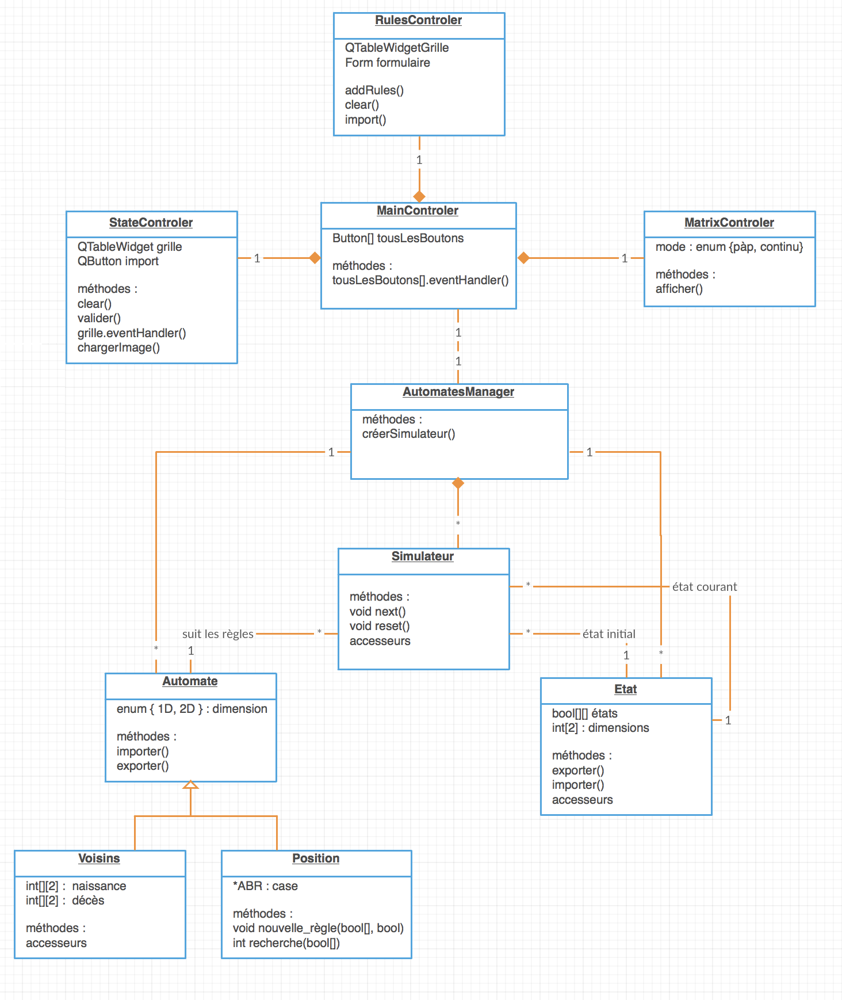

Projet-LO21
===

# Guidelines
* Full English
* Full camelCase

# UML


# Files
## Automaton
**/!\\ Obselete***
``` json
{
   "nbNeighboor": 5,
   "default": 2,
   "absolutePositions": [
       "1:0,1,1,0,0",
       [0, 1, 0, 0, 0],
       [1, 0, 0, 1, 0],
       [1, 1, 1, 1, 0]
   ],
   "softPositions": [
       "1:0,1,5-1,0,1",
       [1, [0, 1, 5], [1, 0, 1]],
       [0, [0], [0]]
   ],
   "positionTree": ['r', -1, 0, 1, -1, 0, 0, 0, -2, 1, 0, 0, -2, 1, -1, 0, 0, 1, 0, -2, 1, 1, 1, 0, -2],
   "death": [[0,2],[5,6]],
   "birth": [[3,4]]
}
```
### Parameters
* *nbNeighboor**: number of neighboors considering for state transitionning.
* *default*: default value to transition to when the current state is not handled by the other porperties.
   * d: dead
   * s: alive
* *absolutePositions*: particular cases.
* *softPositions*: association list `[s, [i1, i2], [v1, v2]]`, transition the cell value to `s` when slot `i` has value `v**. (soft beacause constraints are softs**

## Conventions for serialization
Encoded in char

### Global
**Celle state**
* `'1'`: 1
* `'0'`: 0

**For next state**
* `'a'`: alive
* `'d'`: dead

### BST

The cell state are implicitly encoded in the edges (left is `'0'` and right is `'1'`) but the n-1 one are explicitly encoded as node value while the nth node value (`'a'` or `'d'`) marks the next state for the current cell if such pattern is matched.

* `'r'`: root

**Serialization**
* `'f'`: fork point
* `'a'`, `'d'`: leaf

### Vectors
* `','`: next value
